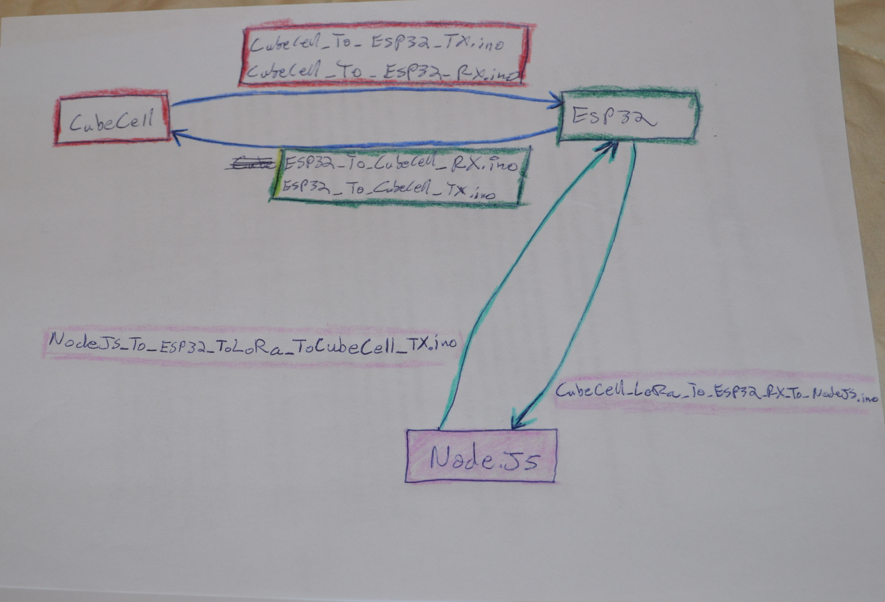

Here is a sketch showing the overview of code that should fit together for biderectional communication with a gateway:

Bidirectional Communication has been achieved by combining files for the CubeCell and the Heltec LoRa ESP32:

Here is the combined code for the CubeCell:
[CubeCell Bidirectional Code](/CubeCell_ToDo/cubecell_morse/src/main.cpp)

Here is the combined code for the LoRa ESP32:
[LoRa ESP32 Bidirectional Code](/ESP32_ToDo/Heltec_LoRa_ESP32_morse/src/main.cpp)

This is a reworking of the overview sketch in the main [README](../..//README.md) .
