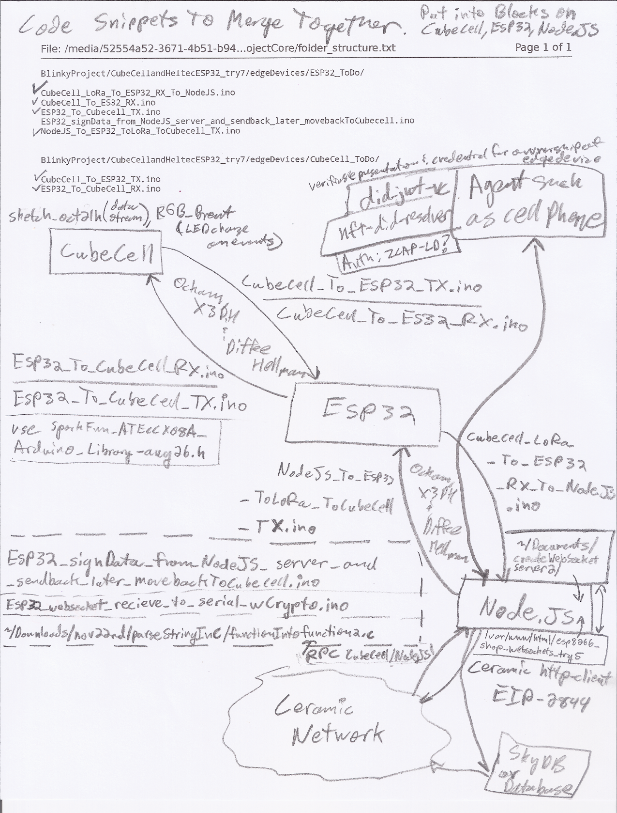
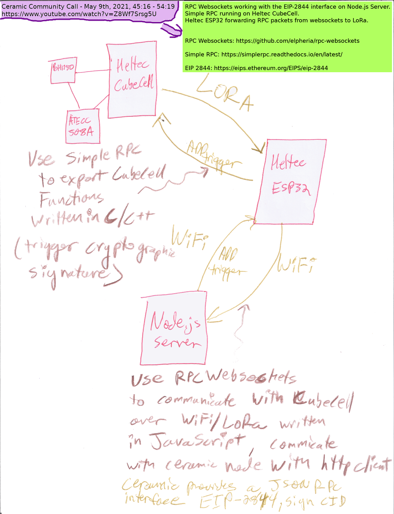
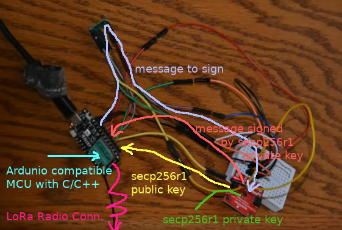
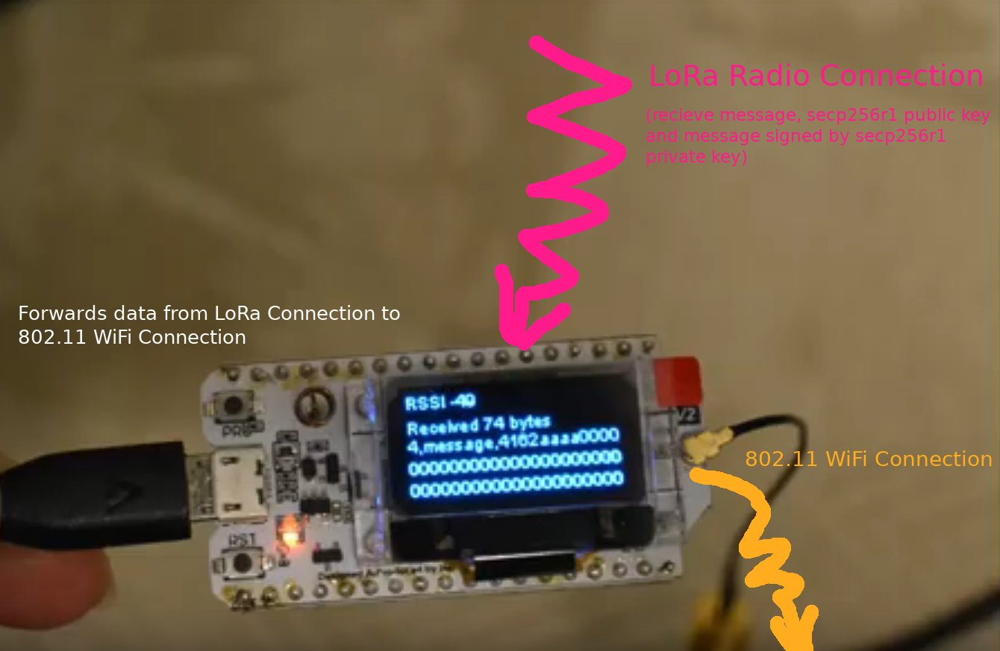
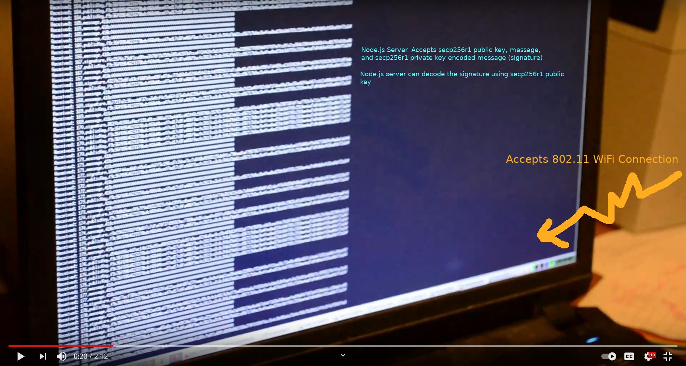
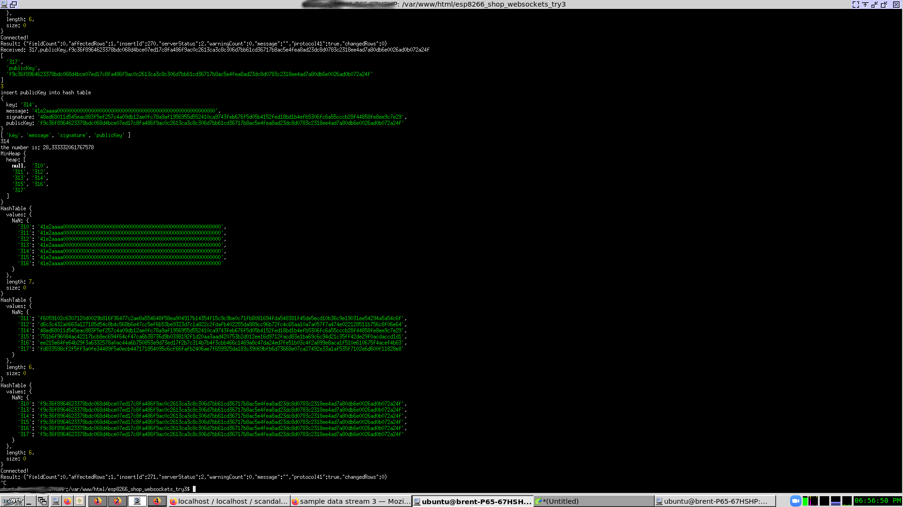

## Possible Use Cases
There are two guys: Joe and Sam. Joe has a few ESP32 devices with various sensors and widgets attached. So does Sam. Sam is getting to know Joe, and would like to provide him access to some sensors. He also wants to store his sensor data in a distributed way because he doesn't trust the big cloud providers. He also like the immutable web of trust, but does not want to settle on a particular blockchain. Sam creates a ceramic document that gives Joe access to the data come from  some his sensors and widgets, and even to an even fewer number he gives Joe to ability to turn on and off the sensor or the widget.

In another use case a teacher is teaching a training class and wants to give pupils access to lockers and equipment (golf carts, power tools)  and rooms to stay they night , but does not want the hassle dealing with physical keys. The teacher just wants things to work once the pupil satisfactorily completes the training. For this [did-jwt-vc](https://github.com/decentralized-identity/did-jwt-vc) is considered.

In another use case someone thinks it would be great to have augmented reality where the holder of an NFT is able to unlock gates, grab an electronically enabled unicorn plush toy from the stuffed animal vendor, or who knows...

Ramblings ...
"People are good at verifying digital credentials with computers and cell phones, but not so much if you want to open a gate or do it over a low bandwidth extended network.
Brent Shambaugh  10 minutes ago
I haven't seen many electronics projects associated with NFTs either.
Brent Shambaugh  9 minutes ago
NFTs seem to be totally a digital construct, like a picture of a dog, cryptographically verified to an owner....but they are not cryptographically verified to an electronic device in the physical dog collar
Brent Shambaugh  7 minutes ago
the dog collar cannot make cryptographically provable assertions about any health care its had, who his or her parents and siblings are .... etc...
Brent Shambaugh  6 minutes ago
For the longest time there have been hardware wallets for Bitcoin.
Brent Shambaugh  6 minutes ago
Maybe I am just reinventing the wheel around this.
Brent Shambaugh  8 minutes ago
I don't know. I've learned a lot. 
"
Interesting, ERC-721 (non-fungible tokens)  mentions physical assets: https://eips.ethereum.org/EIPS/eip-721

Adding LoRa could allow for greater geographic coverage. I was able to pull data from a Cubecell transmission a third of a mile away.

## Rough draft

This is the present Node.js server code https://github.com/bshambaugh/BlinkyProject/tree/master/CubeCellandHeltecESP32_try7/esp8266_shop_websockets . I need to make that clear.  
12:22  
This is the present ESP32 code: https://github.com/bshambaugh/BlinkyProject/tree/master/CubeCellandHeltecESP32_try7/edgeDevices/LoRaESP32/OLED_LoRa_Receiver_edit_wHelloServer
12:25  
This is the present CubeCell code: https://github.com/bshambaugh/BlinkyProject/tree/master/CubeCellandHeltecESP32_try7/edgeDevices/Cubecell/BH1750test_edit2 (I think)  
12:25  
This works with Push. CubeCell to ESP32 to Node.js. Node.js sends to database and broadcasts the data out to a cell phone (or anyone listening on websockets) (edited)   
12:26  
Future...  
12:27  
Bidirectional communication with the CubeCell (RX and TX): https://github.com/bshambaugh/BlinkyProject/tree/master/CubeCellandHeltecESP32_try7/edgeDevices/CubeCell_ToDo . Merge these plus anything with the present CubeCell code + remote signer implementation (mentioned later)  
12:29  
Quaddirectional communication with the ESP32. (RX and TX to the cubecell) (RX and TX to the Node.js server)  
12:29  
https://github.com/bshambaugh/BlinkyProject/blob/master/CubeCellandHeltecESP32_try7/edgeDevices/ESP32_ToDo/ESP32_To_Cubecell_TX.ino  
https://github.com/bshambaugh/BlinkyProject/blob/master/CubeCellandHeltecESP32_try7/edgeDevices/ESP32_ToDo/CubeCell_To_ES32_RX.ino  
12:30  
https://github.com/bshambaugh/BlinkyProject/blob/master/CubeCellandHeltecESP32_try7/edgeDevices/ESP32_ToDo/CubeCell_LoRa_To_ESP32_RX_To_NodeJS.ino  
https://github.com/bshambaugh/BlinkyProject/blob/master/CubeCellandHeltecESP32_try7/edgeDevices/ESP32_ToDo/NodeJS_To_ESP32_ToLoRa_ToCubecell_TX.ino  
12:31  
remote signer code:  
12:31  
https://github.com/bshambaugh/BlinkyProject/blob/master/CubeCellandHeltecESP32_try[…]ta_from_NodeJS_server_and_sendback_later_movebackToCubecell.ino   :doughnut: (edited)  
12:32  
move this code to the CubeCell. For now it is incubating on the ESP32. Aside from the device (CubeCell) the communication mechanism will also change. Websockets over Wifi will become LoRa. (edited)   
12:35  
This is to add talking to ceramic functionality to the Node.js server: https://github.com/bshambaugh/BlinkyProject/tree/master/CubeCellandHeltecESP32_try7/esp8266_shop_websockets/CeramicToDo  
12:36  
This is what I am going to try to use on the Node.js side to talk to the :doughnut: code as a remote signer. https://github.com/bshambaugh/BlinkyProject/blob/master/CubeCellandHeltecESP32_try[…]8266_shop_websockets/custom/verifySignature/verifySignatureQ.js  

Here is a visual representation of how the code will fit together:

The code I have been working on is particular to the P-256 curve. I had hoped that development would inform my general understanding of ceramic integration. Some of the code will be re-used if another cryptographic curve is used (particularly the code on the Heltec LoRa ESP32 and CubeCell as well as the general flow
of the code on the CeramicToDo). Finding an edge device on the network has been an idea explored and current research and/or thinking suggests this will combine a did:key (unique identifier provided by the cryptographic co-processor re-written) and some form of index of the ceramic network. At least my gut
feeling has been that it might be better to persist data stored from sensors in SkyNet/SkyDB and integrate this with ceramic as in an earlier tutorial provided by Ceramic.

I predict I will follow this example code [ceramic ToDo](/CubeCellandHeltecESP32_try7/esp8266_shop_websockets/CeramicToDo/README.md)  
This will require a P-256 version of [key-did-provider-ed25519](https://github.com/ceramicnetwork/key-did-provider-ed25519) .

I will call this something like key-did-provider-P256 (edit now here: [key-did-provider-p256](https://github.com/bshambaugh/key-did-provider-p256)) or key-did-provider-NIST (if I want to support P-256, P-384, and P-521 by the same provider).
This key-did-provider will depend on [did-jwt](https://github.com/decentralized-identity/did-jwt/), [rpc-utils](https://github.com/ceramicnetwork/js-rpc-utils) , and [dids](https://github.com/ceramicnetwork/js-did) . The resolver for the key-did-provider is being implemented here [PR 1884](https://github.com/ceramicnetwork/js-ceramic/pull/1884).

Edit, Marth 12th, 2022: Here is an example of early code for the remote signer in the folder: createWebSocketServer2_2 .
Try to plug in with this: https://github.com/decentralized-identity/did-jwt/blob/master/docs/guides/index.md#creating-custom-signers-for-integrating-with-hsm
 
Support for did-jwt for P-256 for the provider is described here: [PR 212](https://github.com/decentralized-identity/did-jwt/pull/212) and being implemented here: [did-jwt](https://github.com/bshambaugh/did-jwt) (I believe this needs to be done). rpc-utils and dids do not need to be changed.

I tried to explain my thoughts to Joel with Ceramic in May: [twitter post about Joel](https://twitter.com/Brent_Shambaugh/status/1467197731101941761?s=20)  
He seemed to calm my worries about the data packets verifying updates being too large for LoRa to handle, since he claimed that they would be CIDs (streamIDs in ceramic in think).
StreamID description in [CIP-59](https://github.com/ceramicnetwork/CIP/blob/main/CIPs/CIP-59/CIP-59.md).

Ceramic eloquently allows a blockchain to maintain state, but minimized data and writes:
see [CIP-69](https://github.com/ceramicnetwork/CIP/blob/e71e833f8249fe3663f6de8aeed572578a7866e0/CIPs/CIP-69/CIP-69.md) for Ceramic blockchain Anchoring.
for how Ceramic describes its [Architecture](https://developers.ceramic.network/reference/typescript/pages/Ceramic%20Typescript%20Implementation/overview.html).

For now, this Playlist gives earlier evolution of the Blinky Project. Much, if not all, of the The Ceramic Network work is not included.  
[Blinky Project on YouTube](https://www.youtube.com/playlist?list=PLbVZNfQhcZ3eQpiBUY_0IaXPmPE5pZoOT))  

Here is an earlier sketch of the architecture.  
  

Here is the Cubecell pushing data to the ESP32 in the earlier architecture:

Here is the ESP32 receiving data from the ESP32 and pushing it to the NodeJS server:

Here is the NodeJS server receiving data from the ESP32:

Here is the NodeJS server receiving data from the ESP32 and writing to a database and rebroadcasting on websockets:

## More stuff to consider once Ceramic Network is linked in:
https://github.com/decentralized-identity/did-jwt-vc (for verifiable credentials)
https://www.w3.org/TR/vc-data-model/ (for verifiable credentials). The goal would be to only have the LoRa device see streamIDs, and let ceramic take care of long JSON documents needed for credentials. 
Geovane Fedrecheski eloquently went into the difficulties of LoRa handling at [IIW32A - session 12E](https://raw.githubusercontent.com/windley/IIW_homepage/gh-pages/assets/proceedings/IIW_32_Book_of_Proceedings_Final%20A%201.pdf).
To get this working with and Agent talking to the Node.js server, which talks to the ceramic network, consider Bjorn Hamel's excellent talk: [Adventures in Self-Soverign Identity](https://www.youtube.com/watch?v=Uu651GJ5YY0) .

For Authorization, consider looking at: [Authorization Capabilities for Linked Data v0.3](https://w3c-ccg.github.io/zcap-ld/). Thank you to the W3C CCG Mailing List. Further exploration for this by Ceramic is described in this [blog post](https://blog.ceramic.network/capability-based-data-security-on-ceramic/) which talks about [CACAO](https://github.com/ceramicnetwork/cacao) in the context of "Capability Based Security for Ceramic".

https://github.com/ceramicnetwork/nft-did-resolver (for NFTs) [It seems you would use key:did with 3ID, and 3ID with NFT]
seeAlso: [3ID method CIP-79](https://github.com/ceramicnetwork/CIP/blob/main/CIPs/CIP-79/CIP-79.md)

Sensor data needs to be transmitted securely. The first experiment only considered authentication. Ockam is looking at secure channels, and is familiar with SSI like Ceramic/3Box/uPort is: [friendly discussion](https://github.com/ockam-network/ockam/discussions/137) , [homepage](https://www.ockam.io/).
See also X3DH & Diffe Hellman. Also, I am not sure this will help (if it is desireable to bring in Ockam).  Ockam has a preference for Rust, which can be framed in the form of C like exisitng ESP32 code has using this [library](https://github.com/espressif/rust-esp32-example)?
To integrate Node.js with Rust also see: [Rust is the Future of JavaScript Infrastructure](https://leerob.io/blog/rust).

Elliptic curves can be generated on an ESP32 without the use of a cryptographic co-processor. See libraries [Elliptic-Curve-on-ESP32](https://github.com/Bizyroth/Elliptic-Curve-on-ESP32) and [micro-ecc](https://github.com/kmackay/micro-ecc) . Perhaps there will be issues with securing and preserving the private keys?

https://medium.com/ceramic/idx-and-skydb-joins-forces-for-a-future-of-web3-hackathon-83eff179a9a1 , https://www.youtube.com/watch?v=-Y36JvYXwrw (skydb, possible sensor data storage option)
seeAlso: [Encrypted Data Vaults](https://github.com/decentralized-identity/edv-spec) and whatever Ceramic is trying to integrate with.

Consider funding schemes:
https://www.youtube.com/watch?v=IV59r4JcOIg, Superfluid: DeFi Surf Lesson - Money Streaming
https://github.com/bshambaugh/thegraphReactApp/tree/master/src (early superfluid experiments)
http://bshambaugh.org/MNDF_Project.html  (MNDF Project)
https://www.helium.com/ (compare)

Extended LoRa. https://github.com/RbtsEvrwhr-Riley/CellSol (Extended LoRa/simple apps), https://github.com/G4lile0/tinyGS (Extended LoRa)

Finding stuff on Ceramic: https://tiles.ceramic.community/ , https://thegraph.com/en/ (future index ceramic), https://www.youtube.com/watch?v=wrV7cMebwyE (The Graph 🛠 Building Rich APIs on top of Ethereum with The Graph - Nader Dabit - Web3Weekend), https://github.com/mdaquin/Watson-Indexer- (Inspiration)

Better data management. Investigate Applied Category Theory. Alan Ransil from Protocol Labs (https://research.protocol.ai/) showed some interest in it at the ACT Workshop. Dr. Spivak was there and separately Dr. Wisnesky who has been working with him suggested I checkout "Formal Modelling and Application of Graph Transformations in the Resource Description Framework by Benjamin Braatz" (https://core.ac.uk/display/57704480). Also consider https://jena.apache.org/documentation/io/rdf-json.html ,  https://dashjoin.medium.com/json-schema-schema-org-json-ld-whats-the-difference-e30d7315686a , https://json-schema.org/understanding-json-schema/about.html , and Semantic Sensor Data Search in a Large-Scale Federated Sensor Network , http://ceur-ws.org/Vol-839/calbimonte.pdf , https://github.com/cloudprivacylabs (Layered Schemas), Dr. Joshua Shinavier: Dragon (see: https://www.meetup.com/Category-Theory/), https://github.com/inkandswitch/cambria-project, Brooklyn Zelenka may have mentioned ACT in a blog post on https://fission.codes/ , migration instead of global source of truth in HL Ontology (https://www.youtube.com/watch?v=bk36__qkhrk : Dr. Spivak Categorical Databases). 
